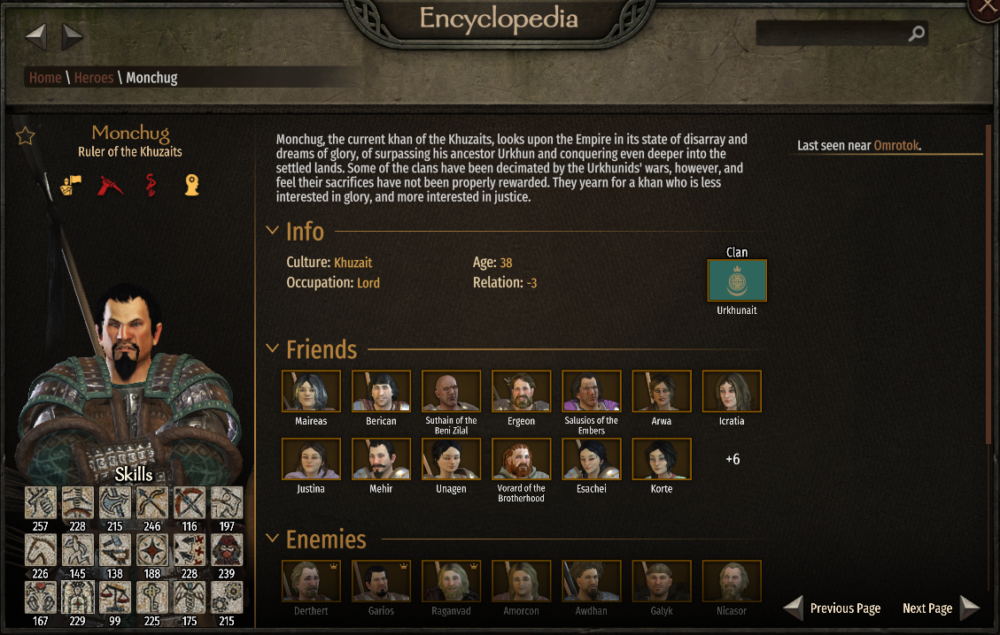
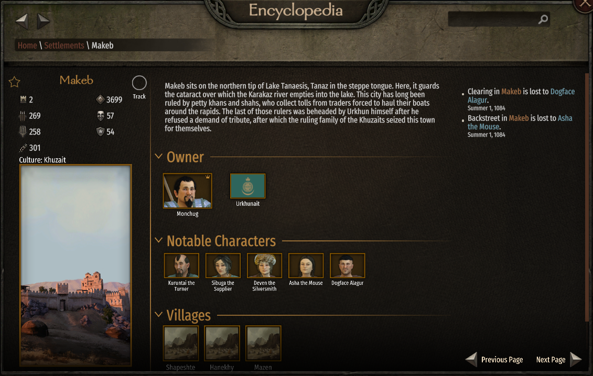
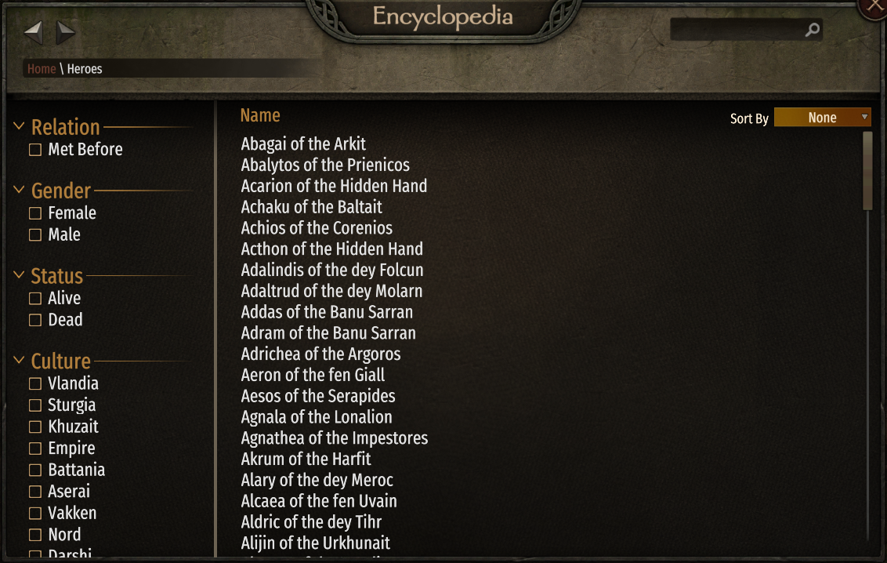
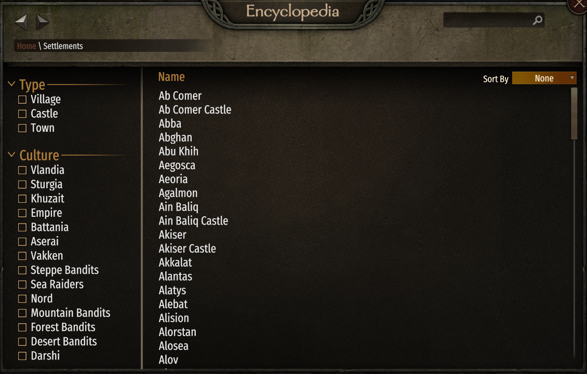
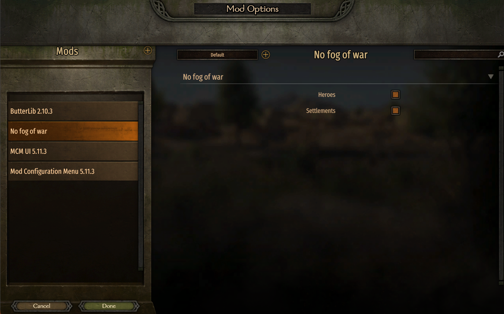

# No Fog of War

This mod removes the Fog of War system and making all settlements and characters visible in the in-game encyclopedia.

## Youtube video

## Features
* Reveal only settlements
* Reveal only characters
* Reveal both settlements and characters

## Screenshots

    
    
    
    
    

## Requirements

* [Mount & Blade II: Bannerlord](https://www.taleworlds.com/tr/Games/Bannerlord) >= 1.3.x version.
* [Harmony](https://www.nexusmods.com/mountandblade2bannerlord/mods/2006)
* [ButterLib](https://www.nexusmods.com/mountandblade2bannerlord/mods/2018)
* [UIExtenderEx](https://www.nexusmods.com/mountandblade2bannerlord/mods/2102)
* [Mod Configuration Menu](https://www.nexusmods.com/mountandblade2bannerlord/mods/612)

## Installation:
1. Extract archive using 7zip
2. Place in Mount & Blade II Bannerlord\Modules folder
3. Enable in launcher and organize alphabetically

**Compatibility:** Can be added/removed anytime. Does not modify save files.

**Localization support for:** BR, DE, FR, IT, PL, RU, SP, TR

**Mod on Nexus Mods:** https://www.nexusmods.com/mountandblade2bannerlord/mods/9355

**Mod on Steam Workshop:** https://steamcommunity.com/sharedfiles/filedetails/?id=3619511875

## My other mods

* [Marriage Offers For Player](https://github.com/mitrax215/Bannerlord.MarriageOffersForPlayer) Allows the player to receive marriage offers just like other clan members.
* [Keep Your Clan Members After Marriage](https://github.com/mitrax215/Bannerlord.KeepYourClanMembersAfterMarriage) This mod makes your clan members stay in your clan after they get married.